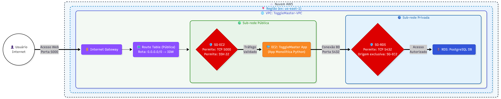
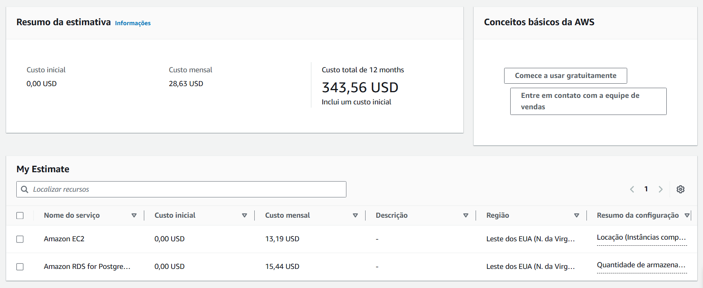

# 🚀 ToggleMaster - DevOps & Cloud Architecture Journey


> **ToggleMaster**: Uma plataforma de gerenciamento de *Feature Flags* em transição de um MVP Monolítico para uma arquitetura nativa em nuvem (Cloud-Native) e distribuída.

Este repositório documenta a evolução arquitetural do projeto **ToggleMaster**, desenvolvido como Tech Challenge para a Pós-graduação em DevOps & Cloud Architecture da FIAP. O sistema permite que equipes de desenvolvimento lancem novas funcionalidades de forma controlada via *Feature Toggles*, garantindo estabilidade em produção.

---

## 📑 Índice
- [🚀 ToggleMaster - DevOps \& Cloud Architecture Journey](#-togglemaster---devops--cloud-architecture-journey)
  - [📑 Índice](#-índice)
  - [🛤️ Sobre o Projeto (Visão Evolutiva)](#️-sobre-o-projeto-visão-evolutiva)
  - [🏗️ Fase 1: O Monolito na AWS](#️-fase-1-o-monolito-na-aws)
    - [Arquitetura AWS (As-Built)](#arquitetura-aws-as-built)
    - [Análise: Monolito vs. MVP](#análise-monolito-vs-mvp)
    - [Avaliação 12-Factor App](#avaliação-12-factor-app)
      - [Discussão: Metodologia 12-Factor App aplicada ao ToggleMaster](#discussão-metodologia-12-factor-app-aplicada-ao-togglemaster)
  - [⚙️ Pré-requisitos](#️-pré-requisitos)
  - [🚀 Como Executar](#-como-executar)
    - [1. Rodando Localmente (Validação Docker)](#1-rodando-localmente-validação-docker)
    - [2. Execução em Produção (AWS EC2)](#2-execução-em-produção-aws-ec2)
  - [💰 FinOps: Estimativa de Custos](#-finops-estimativa-de-custos)
    - [Justificativas](#justificativas)
  - [🚧 Desafios e Decisões Técnicas](#-desafios-e-decisões-técnicas)
  - [📦 Entregáveis da Fase 1](#-entregáveis-da-fase-1)
  - [🏷️ Versionamento](#️-versionamento)
  - [👨‍💻 Autor](#-autor)

---

## 🛤️ Sobre o Projeto (Visão Evolutiva)

Para espelhar cenários reais da indústria, este projeto foi planejado para evoluir em 4 fases. Em vez de criar múltiplos repositórios, a evolução arquitetural é mantida aqui, utilizando **Git Tags** e **Releases** para marcar cada etapa concluída.

* **[ ATUAL ] Fase 1:** MVP Monolítico hospedado em instâncias EC2 e RDS na AWS.
* **[ EM BREVE ] Fase 2:** *A definir.*
* **[ EM BREVE ] Fase 3:** *A definir.*
* **[ EM BREVE ] Fase 4:** *A definir.*

---

## 🏗️ Fase 1: O Monolito na AWS

A primeira versão do ToggleMaster é um MVP validado através de uma API em Python/Flask que permite operações de CRUD em feature flags. A infraestrutura foi provisionada na AWS seguindo rigorosamente as melhores práticas de isolamento de rede e o Princípio do Menor Privilégio.

### Arquitetura AWS (As-Built)

A infraestrutura foi desenhada garantindo que a camada de aplicação fique publicamente acessível, enquanto a camada de dados permanece isolada e protegida em uma rede privada.



**Decisões de Design de Rede:**
* **Isolamento de Dados:** O banco de dados RDS não possui IP público e está alocado em uma sub-rede privada, sem rota de saída ou entrada direta para a internet.
* **Segurança Restrita:** O Security Group do banco (`SG-RDS`) não aceita conexões de IPs ou faixas de rede, mas exclusivamente da origem atrelada ao ID do `SG-EC2`.

### Análise: Monolito vs. MVP

A aplicação foi desenvolvida em uma arquitetura monolítica (toda a lógica de roteamento, negócio e persistência no mesmo processo). 

**Vantagens para o MVP:**
* **Velocidade de Entrega e Validação:** O objetivo central de um MVP é validar uma funcionalidade com uma API simples e receber feedback rapidamente. Como o monolito agrupa front-end, back-end e lógica de negócio em uma única unidade, o desenvolvimento inicial é mais acelerado.
* **Simplicidade de Desenvolvimento e Gerenciamento:** Para equipes pequenas, o monolito permite focar na regra de negócio sem a necessidade de gerenciar a complexidade de múltiplos serviços independentes. Gerenciar um único servidor ou instância (como uma EC2) é vantajoso pela simplicidade de gestão em cenários iniciais.
* **Facilidade na Gestão de Dados:** Em um sistema monolítico, o uso de um banco de dados centralizado facilita a manutenção da consistência dos dados e a execução de transações ACID (Atomicidade, Consistência, Isolamento e Durabilidade), garantindo que as operações sejam atômicas de forma mais direta do que em ambientes distribuídos.
* **Deploy Simplificado**: A aplicação é implantada como uma única entidade, o que reduz drasticamente a sobrecarga operacional e a complexidade dos pipelines de deploy no início do projeto.
* **Menor Custo Inicial de Infraestrutura**: Ao rodar tudo em uma infraestrutura simplificada, evita-se o desperdício de recursos que pode ocorrer ao tentar escalar partes específicas de uma aplicação que ainda não possui tráfego volumoso.

**Desvantagens para o MVP:**
* **Dependências Fortes e Risco de Falha Sistêmica:** Em um monolito, todos os módulos estão interligados. Isso significa que uma falha em um componente específico (como o módulo de gerenciamento de flags) pode afetar todo o sistema e derrubar a aplicação completa.
* **Dificuldade de Escalabilidade Direcionada:** Se apenas uma funcionalidade do ToggleMaster (como a consulta de flags por APIs externas) demandar mais recursos, você será obrigado a escalar a aplicação inteira, o que resulta em desperdício de recursos computacionais e aumento de custos na AWS.
* **Ciclo de Entrega mais Arriscado**: Como a aplicação é uma unidade única, qualquer pequena alteração no código exige a recompilação e reimplantação de todo o bloco, exigindo testes extensivos para garantir que a mudança não quebrou partes não relacionadas.
* **Acoplamento Tecnológico:** O monolito geralmente limita a equipe a uma única stack tecnológica. Diferentes partes do projeto que poderiam se beneficiar de linguagens ou bancos de dados específicos ficam presas à escolha inicial.

**Futuros Desafios:**
* **Complexidade de Manutenção:** À medida que o ToggleMaster ganhar novas funcionalidades, o código se tornará um "grande bloco" difícil de gerenciar, onde correções de bugs podem ter impactos inesperados e arriscados em outras partes do sistema.
* **O Desafio da Migração (Refatoração):** O maior desafio futuro será a transição para microsserviços. Isso exigirá decompor a aplicação usando conceitos como Domain-Driven Design (DDD) e identificar "contextos delimitados" (bounded contexts) para separar as responsabilidades.
* **Gestão de Dados Distribuídos:** Ao migrar para um sistema distribuído, você enfrentará a dificuldade de manter a consistência dos dados. Diferente do monolito, onde as transações ACID são simples, em microsserviços você precisará lidar com a consistência eventual e padrões complexos como Sagas ou CQRS.
* **Resiliência e Alta Disponibilidade:** Rodar o MVP em uma única instância EC2 cria um ponto único de falha. O desafio futuro será configurar Auto Scaling e Load Balancers para garantir que a aplicação sobreviva a picos de tráfego ou falhas em uma zona de disponibilidade da AWS.
* **Segurança e Governança:** Conforme a equipe cresce, gerenciar permissões de acesso e segredos (chaves de API e senhas) se torna crítico. O uso de ferramentas como AWS Secrets Manager e políticas de IAM mais granulares será indispensável para evitar vazamentos e acessos indevidos.

### Avaliação 12-Factor App

A arquitetura do **ToggleMaster** foi analisada sob a ótica da metodologia *12-Factor App*, fundamental para aplicações *cloud-native*. Abaixo, detalhamos o nível de aderência do MVP (Fase 1) a esses princípios:

**Legenda:**
* ✅ **Atende:** O fator é cumprido integralmente seguindo as melhores práticas.
* ⚠️ **Parcial:** O fator é atendido conceitualmente, mas apresenta pontos de melhoria para fases futuras (automação/escala).
* ❌ **Não atende:** O fator não é atendido.

| Fator | Status | Justificativa Técnica |
| :--- | :---: | :--- |
| **I. Base de Código** | ✅ | Há um único repositório para a aplicação, o que permite múltiplos deploys (staging, prod) a partir da mesma base. |
| **II. Dependências** | ✅  |O uso de `requirements.txt` com versões fixas (ex: `Flask==2.2.2`) garante que a aplicação não dependa de pacotes instalados globalmente no sistema. |
| **III. Configurações** | ⚠️ | Embora o `app.py` use `os.getenv`, o `docker-compose.yaml` contém segredos expostos (senhas). Segundo o 12-factor, configurações sensíveis nunca devem estar no controle de versão. |
| **IV. Serviços de Apoio** | ✅ | O PostgreSQL é tratado como um recurso anexado. A aplicação não diferencia entre um banco local ou um RDS na nuvem; ela apenas consome a URL/credencial fornecida. |
| **V. Construa, lance, execute** | ❌ | O deploy manual na EC2 mistura as etapas. Não há um artefato de build imutável (como uma imagem Docker em um registro) que seja apenas "configurado" para o release. |
| **VI. Processos** | ✅ | A aplicação é totalmente *stateless*. Ela não usa o sistema de arquivos local para persistência, delegando tudo ao banco de dados. |
| **VII. Vínculo de Portas** | ✅ | O serviço exporta HTTP ao se vincular à porta 5000. O uso do Gunicorn reforça que a app é autossuficiente e não depende de um servidor injetado (como um Apache externo). |
| **VIII. Concorrência** | ⚠️ | O uso de *workers* no Gunicorn permite escala vertical, mas a arquitetura monolítica ainda dificulta a escalabilidade horizontal granular (escalar apenas a escrita de flags, por exemplo). |
| **IX. Descartabilidade** | ✅ | O processo inicia rápido e o script `entrypoint.sh` garante que a app aguarde o banco, permitindo que instâncias sejam desligadas e ligadas sem corromper o estado. |
| **X. Paridade Dev/Prod** | ⚠️ | Rodar Docker no desenvolvimento e fazer instalação manual via `pip/apt` na EC2 de produção quebra a paridade de execução. |
| **XI. Logs** | ✅ | A aplicação escreve no `stdout`. O 12-factor diz que a app não deve gerenciar seus arquivos de log; ela apenas emite o fluxo, e o ambiente (Docker/AWS) captura e direciona. |
| **XII. Processos Admin** | ✅ | O comando `flask init-db` via CLI permite executar tarefas administrativas no mesmo ambiente e com o mesmo código da aplicação. |

#### Discussão: Metodologia 12-Factor App aplicada ao ToggleMaster

A análise do ToggleMaster Monolith sob a ótica da metodologia 12-Factor App revela uma aplicação com fundamentos de código sólidos, mas que ainda apresenta desafios significativos nos pilares de infraestrutura, processos de deploy e paridade de ambientes. Esta discrepância é comum em fases de MVP, servindo como um mapa para a evolução do projeto. No que tange à robustez do código, o sistema demonstra maturidade ao atender plenamente fatores como Processos, Vínculo de Portas e Logs. A arquitetura é essencialmente stateless e agnóstica, com um destaque especial para o fator de Descartabilidade, uma vez que o uso do script entrypoint.sh aliado ao comando pg_isready garante que a aplicação aguarde o serviço de apoio antes de iniciar, o que favorece a resiliência e a inicialização rápida exigida pelo modelo.

Entretanto, o gerenciamento de configurações e segurança apresenta pontos de atenção importantes. Embora o código Python utilize boas práticas ao buscar variáveis via os.getenv, o ecossistema falha no fator de Configurações ao manter segredos expostos em arquivos de configuração. O fato de o docker-compose.yaml versionar senhas explícitas viola a exigência de separação estrita entre código e configuração, lembrando que segredos nunca devem ser rastreados pelo controle de versão. Essa fragilidade se estende ao ciclo de vida de entrega, especificamente no fator Construa, Lance, Execute. Atualmente, o deploy na AWS mistura essas etapas ao instruir a instalação de dependências e a clonagem de código diretamente na instância EC2, o que impede a imutabilidade do artefato e impossibilita a existência de um processo de release devidamente versionado.

Essa dinâmica de deploy manual reflete negativamente na Paridade entre Desenvolvimento e Produção, evidenciando um hiato de ferramentas considerável. Enquanto o ambiente de desenvolvimento é baseado em containers Docker, a produção segue um modelo tradicional de instalação manual, o que aumenta o risco de divergências de comportamento entre as pontas. Além disso, a escalabilidade é afetada pelo modelo monolítico no fator de Concorrência. Embora o uso de workers no Gunicorn permita uma escala vertical interna, a escalabilidade horizontal fica limitada à unidade inteira, impedindo que funções específicas de maior demanda sejam isoladas e escaladas de forma granular e eficiente.

Para que o ToggleMaster alcance a conformidade plena em fases futuras, é fundamental converter esses pontos parciais ou negativos em positivos através da modernização da infraestrutura. A implementação de pipelines de CI/CD, utilizando ferramentas como GitHub Actions, permitirá a geração de imagens Docker imutáveis, garantindo a separação real entre as fases de build e run. Complementarmente, a migração para serviços de orquestração como Amazon ECS ou EKS assegurará que o mesmo container utilizado no desenvolvimento seja replicado em produção. Por fim, a adoção de gestores de segredos, como o AWS Secrets Manager, será o passo decisivo para remover credenciais sensíveis do repositório, garantindo uma arquitetura segura, escalável e totalmente alinhada às melhores práticas de nuvem.

---

## ⚙️ Pré-requisitos

Para rodar este projeto ou provisioná-lo, você precisará de:
* Conta ativa na AWS (Free Tier/Academy).
* [Docker](https://www.docker.com/) e `docker-compose` instalados para ambiente local.
* SSH Client e [Postman](https://www.postman.com/) (ou `curl`) para validação da API.

---

## 🚀 Como Executar

### 1. Rodando Localmente (Validação Docker)
```bash
# Clone o repositório
git clone https://github.com/artur-duart/togglemaster-devops-fiap.git
cd togglemaster-devops-fiap

# Suba os containers da aplicação e do banco de dados
docker-compose up --build

# Valide a disponibilidade
curl http://localhost:5000/health
```

### 2. Execução em Produção (AWS EC2)
Após provisionar a infraestrutura e acessar via SSH:

```bash
# Clone e prepare o ambiente virtual
git clone https://github.com/artur-duart/togglemaster-devops-fiap.git
cd togglemaster-devops-fiap
python3 -m venv venv
source venv/bin/activate
pip install -r requirements.txt

# Injeção das credenciais do RDS
export DB_HOST='[SEU_ENDPOINT_RDS]'
export DB_NAME='togglemaster'
export DB_USER='postgres'
export DB_PASSWORD='[SUA_SENHA]'

# Inicialize o banco de dados via CLI Administrativa
flask init-db

# Execute a aplicação
gunicorn --bind 0.0.0.0:5000 app:app
```

---

## 💰 FinOps: Estimativa de Custos

A arquitetura foi planejada para validação otimizada, priorizando recursos com alto custo-benefício.

* **EC2:** 1x `t3.micro` (Linux, 20GB EBS) - ~$9.19/mês
* **RDS:** 1x `db.t3.micro` (PostgreSQL, Single-AZ) - ~$15.44/mês
* **Rede:** 1x Endereço IPv4 Público - ~$4.00/mês
* **Total Estimado:** **~$28.63 USD / Mês**



🔗 [Ver cálculo detalhado na AWS Pricing Calculator](https://calculator.aws/#/estimate?id=f96267be6f9d8ca2434756a32d51148020cd81c9)

### Justificativas

1. **Escolha da Região: US East (N. Virginia):**
A escolha da região us-east-1 é uma decisão estratégica de FinOps. Por ser a região principal da AWS, ela oferece o menor custo global para a maioria dos serviços e é a primeira a receber novas funcionalidades. Para um MVP onde a latência mínima em São Paulo não é o requisito crítico imediato, essa escolha otimiza o orçamento do projeto.

2. **Amazon EC2 (Camada de Aplicação):**
A instância t3.micro foi selecionada para hospedar o container Docker da aplicação Flask. Com 2 vCPUs e 1 GiB de memória, a família T3 oferece o equilíbrio necessário para o runtime do Python e o gerenciamento do Docker. O uso de instâncias burstable é ideal para aplicações de gerenciamento de flags, que possuem picos de uso durante requisições de verificação, mas permanecem ociosas na maior parte do tempo. A Locação Compartilhada foi selecionada para minimizar custos, já que não há requisitos de conformidade que exijam hardware dedicado. A Estratégia On-Demand justifica-se pela necessidade de disponibilidade total durante o período de avaliação e testes da Fase 1, sem os riscos de interrupção de instâncias Spot ou o compromisso de longo prazo de Savings Plans neste estágio inicial.

3. **Amazon EBS (Armazenamento de Bloco):**
O armazenamento com Volume de 20 GB é suficiente para o sistema operacional (Linux) e as imagens Docker. A escolha do tipo gp3 em vez do antigo gp2 é uma prática recomendada de FinOps, pois o gp3 é 20% mais barato por GB e oferece performance de IOPS independente da capacidade do volume.

4. **Endereço IPv4 Público (Acessibilidade):**
Para cumprir o requisito de que a aplicação deve estar acessível publicamente, foi provisionado um endereço IPv4 público. De acordo com a atualização de tarifação da AWS (2024), todos os IPs públicos (mesmo em uso) possuem um custo fixo. O valor é de $0,005 por hora. Considerando um mês comercial médio de 730 horas ($0,005 * 730), chegamos ao valor aproximado de $3,65. Para fins de estimativa conservadora na calculadora, arredondamos este custo operacional para $4,00 mensais.

5. **Amazon RDS para PostgreSQL (Camada de Dados):**
Diferente de rodar o banco dentro da EC2, o uso do RDS gerenciado eleva a maturidade da arquitetura. A instância db.t3.micro é condizente com o tamanho da aplicação. Como o ToggleMaster armazena apenas metadados de flags, uma instância micro suporta a carga com folga. Para um MVP de Fase 1, a alta disponibilidade (Multi-AZ) foi descartada para reduzir o custo pela metade, mantendo o foco na funcionalidade e persistência básica. OArmazenamento 20 GB (gp3) foi escolhido seguindo o padrão de performance e economia adotado na EC2, garantindo consistência na arquitetura de storage.

---

## 🚧 Desafios e Decisões Técnicas

A transição de um ambiente local (Docker) para o primeiro contato prático com uma infraestrutura cloud na AWS trouxe desafios operacionais importantes que moldaram as decisões do projeto:

1.  **O Paradigma de Isolamento de Redes na AWS (VPC)**

      * **O Desafio:** A primeira grande dificuldade foi entender como manter a aplicação publicamente acessível para os usuários finais, mas proteger o banco de dados contra acessos indevidos vindos da internet.
      * **A Decisão:** Optamos por não utilizar a VPC padrão da AWS. Desenhamos uma VPC customizada criando uma Sub-rede Pública atrelada a um Internet Gateway (onde a EC2 foi posicionada) e uma Sub-rede Privada sem rota externa (onde o RDS foi isolado).

2.  **Firewalls e o Princípio do Menor Privilégio**

      * **O Desafio:** Como fazer o RDS aceitar os dados da EC2 se ele está em uma rede isolada, sem criar brechas de segurança abrindo portas para blocos IP inteiros?
      * **A Decisão:** Em vez de usar IPs, configuramos as regras de *Inbound* no Security Group do banco (`SG-RDS`) para aceitar tráfego na porta 5432 exclusivamente a partir do ID do Security Group da EC2. Também blindamos a administração restringindo o acesso SSH (porta 22) apenas ao IP local do desenvolvedor.

3.  **A Transição do Docker para Servidores Linux**

      * **O Desafio:** Em ambiente local, um simples `docker-compose up` cuida de tudo. Na AWS, lidar com o sistema operacional da EC2 de forma manual exigiu o entendimento prático da gestão de pacotes do Ubuntu/Amazon Linux e a criação de ambientes virtuais (`venv`) para o Python.
      * **A Decisão:** Para conectar a aplicação ao banco de dados sem subir arquivos com senhas sensíveis no GitHub, aplicamos rigorosamente o *Fator III* do 12-Factor App, injetando o Host, o Usuário e o Password do RDS como Variáveis de Ambiente no sistema operacional da instância via comando `export`.

4.  **Banco "Vazio" e Processos Presos (Troubleshooting)**

      * **O Desafio:** Ao realizar o primeiro GET na nuvem, o Gunicorn quebrou retornando o erro `relation "flags" does not exist`, pois o RDS havia acabado de ser provisionado e não possuía as tabelas. Ao tentar reiniciar a aplicação, nos deparamos com o erro `Connection in use` na porta 5000.
      * **A Decisão:** Após análise do script local `entrypoint.sh`, identificamos a necessidade de rodar o comando `flask init-db` de forma manual na EC2 para inicializar as tabelas. Para lidar com a porta travada, utilizamos comandos Linux de troubleshooting operacional (`lsof -i :5000` e `kill`) para encerrar processos "zumbis" do Gunicorn.

---

## 📦 Entregáveis da Fase 1

* 🎥 **Vídeo de Demonstração e Defesa Técnica:** [MVP ToggleMaster: Nuvem AWS, EC2 e RDS Privado (Tech Challenge)](https://youtu.be/lp2dKtyjIMs).
* 📄 **Documentação da Arquitetura:** Disponível no diagrama em [Arquitetura AWS (As-Built)](#arquitetura-aws-as-built).
* 🖥️ **Discussão sobre os 12-Factor App aplicada ao projeto:** Disponível em [FinOps: Estimativa de Custos](#discussão-metodologia-12-factor-app-aplicada-ao-togglemaster).
* 💰 **Estimativa de Custos AWS:** Link detalhado em [FinOps: Estimativa de Custos](#-finops-estimativa-de-custos).

---

## 🏷️ Versionamento

Usamos **Git Tags** para marcar as entregas das fases da pós-graduação. O estado exato deste repositório na entrega da Fase 1 pode ser consultado através da tag de *Release*:

* `v1.0.0-fase1` - *Entrega MVP Monolítico EC2/RDS.*

---

## 👨‍💻 Autor

**Artur Duarte de Moraes - RM 370569**
*| IT Operation Engineer no Banco Bradesco | Pós-graduando em DevOps & Cloud Architecture pela FIAP.*
* [LinkedIn](https://www.linkedin.com/in/artur-duart)
* [GitHub](https://github.com/artur-duart)