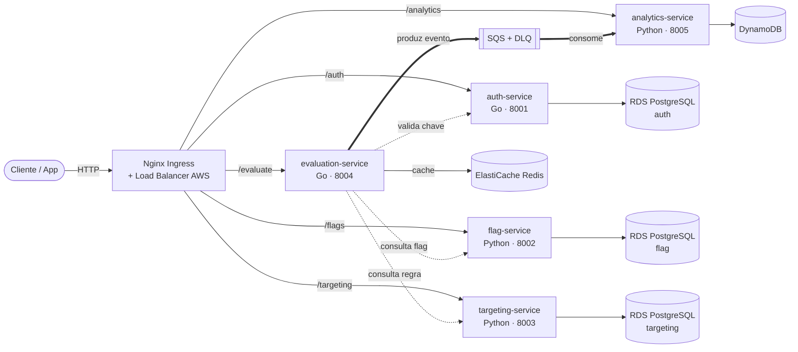
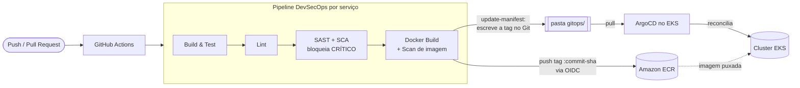
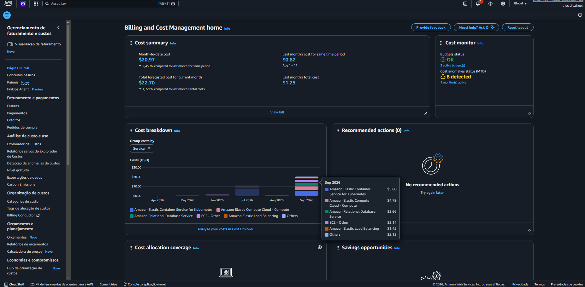

<div align="center">

# 🚀 ToggleMaster — DevOps & Cloud Architecture Journey

**Plataforma de Feature Flags · Fase 3: Infraestrutura como Código, CI/CD DevSecOps e GitOps**


</div>

---

## 📑 Índice

- [🚀 ToggleMaster — DevOps \& Cloud Architecture Journey](#-togglemaster--devops--cloud-architecture-journey)
  - [📑 Índice](#-índice)
  - [🛤 Sobre o Projeto (Visão Evolutiva)](#-sobre-o-projeto-visão-evolutiva)
  - [🎯 O Desafio da Fase 3](#-o-desafio-da-fase-3)
  - [🏗 Arquitetura da Solução](#-arquitetura-da-solução)
    - [Arquitetura da aplicação](#arquitetura-da-aplicação)
    - [Fluxo DevOps: do commit ao cluster (CI + GitOps)](#fluxo-devops-do-commit-ao-cluster-ci--gitops)
  - [🧩 Os 5 Microsserviços](#-os-5-microsserviços)
  - [🟣 Requisito 1 — Infraestrutura como Código (Terraform)](#-requisito-1--infraestrutura-como-código-terraform)
    - [O que foi provisionado](#o-que-foi-provisionado)
    - [Decisões de arquitetura que valem destacar](#decisões-de-arquitetura-que-valem-destacar)
  - [🟢 Requisito 2 — Pipeline de CI e DevSecOps](#-requisito-2--pipeline-de-ci-e-devsecops)
    - [Os estágios do pipeline](#os-estágios-do-pipeline)
    - [Autenticação sem chave estática (OIDC)](#autenticação-sem-chave-estática-oidc)
    - [A regra de bloqueio provada duas vezes](#a-regra-de-bloqueio-provada-duas-vezes)
  - [🟠 Requisito 3 — Entrega Contínua e GitOps](#-requisito-3--entrega-contínua-e-gitops)
    - [Estrutura do repositório de GitOps](#estrutura-do-repositório-de-gitops)
    - [O loop fechado, provado no cluster](#o-loop-fechado-provado-no-cluster)
    - [Detalhes que mostram domínio](#detalhes-que-mostram-domínio)
  - [🔒 Segurança e Modelagem de Ameaças](#-segurança-e-modelagem-de-ameaças)
  - [✅ Rastreabilidade dos Requisitos](#-rastreabilidade-dos-requisitos)
    - [Requisito 1 — IaC](#requisito-1--iac)
    - [Requisito 2 — CI \& DevSecOps](#requisito-2--ci--devsecops)
    - [Requisito 3 — CD \& GitOps](#requisito-3--cd--gitops)
  - [🚀 Como Reproduzir do Zero](#-como-reproduzir-do-zero)
    - [1. Provisionar a infraestrutura](#1-provisionar-a-infraestrutura)
    - [2. Injetar os segredos e a configuração de ambiente](#2-injetar-os-segredos-e-a-configuração-de-ambiente)
    - [3. Fazer o bootstrap do GitOps](#3-fazer-o-bootstrap-do-gitops)
    - [4. Derrubar o ambiente (disciplina de custo)](#4-derrubar-o-ambiente-disciplina-de-custo)
  - [🚧 Desafios e Decisões Técnicas](#-desafios-e-decisões-técnicas)
  - [💰 Disciplina de Custo (FinOps)](#-disciplina-de-custo-finops)
  - [📦 Entregáveis da Fase 3](#-entregáveis-da-fase-3)
  - [🏷 Versionamento](#-versionamento)
  - [👤 Autor](#-autor)

---

## 🛤 Sobre o Projeto (Visão Evolutiva)

Para espelhar cenários reais da indústria, o ToggleMaster evolui em fases, mantidas no mesmo repositório e marcadas com Git Tags:

- ✅ **`v1.0.0-fase1`:** MVP monolítico (Python/Flask) em EC2 com RDS privado.
- ✅ **`v2.0.0-fase2`:** reescrita em 5 microsserviços conteinerizados, orquestrados em Kubernetes (AWS EKS), com escalabilidade automática. A infraestrutura foi provisionada de forma **manual/imperativa** e o deploy usava `kubectl apply` direto.
- 🔵 **`v3.0.0-fase3` `[ATUAL]`:** a mesma plataforma, agora **100% como código e automação**. Toda a infraestrutura vira Terraform, cada serviço ganha um pipeline de CI com portões de segurança (DevSecOps), e o deploy passa a ser declarativo via GitOps com ArgoCD.

> A Fase 3 não muda o que a aplicação faz. Ela transforma **como** a plataforma é construída, verificada e entregue: da criação manual para a Infraestrutura como Código, do deploy imperativo para o GitOps, e da confiança implícita para portões de segurança automatizados.

---

## 🎯 O Desafio da Fase 3

O enunciado pede três transformações sobre a plataforma da Fase 2:

1. **Substituir a criação manual por Terraform**, com um projeto organizado em módulos, provisionando rede, EKS, bancos, mensageria e registries, com o estado remoto no S3.
2. **Criar pipelines de CI com DevSecOps** para os 5 microsserviços, com build, testes, lint, análise estática (SAST), análise de dependências (SCA) e scan de imagem, bloqueando em vulnerabilidade crítica, e publicando no ECR com a tag do commit.
3. **Adotar GitOps**, abandonando o push direto: os manifestos vão para um diretório versionado, o ArgoCD é instalado no cluster, o CI atualiza a tag da imagem no Git, e o ArgoCD sincroniza automaticamente.

> **Nota sobre a modalidade.** O projeto foi desenvolvido na **Opção B (conta pessoal AWS)**, que dá acesso completo ao IAM. Por isso, no lugar da `LabRole` da AWS Academy (Opção A), foram provisionadas **roles de IAM reais e de menor privilégio** (OIDC para o CI e IRSA para os pods), como detalhado adiante.

---

## 🏗 Arquitetura da Solução

### Arquitetura da aplicação


```mermaid
flowchart LR
    Client([Cliente / App]) -->|HTTP| ING[Nginx Ingress<br/>+ Load Balancer AWS]

    ING -->|/auth| AUTH[auth-service<br/>Go · 8001]
    ING -->|/flags| FLAG[flag-service<br/>Python · 8002]
    ING -->|/targeting| TGT[targeting-service<br/>Python · 8003]
    ING -->|/evaluate| EVAL[evaluation-service<br/>Go · 8004]
    ING -->|/analytics| ANL[analytics-service<br/>Python · 8005]

    AUTH --> RDSa[(RDS PostgreSQL<br/>auth)]
    FLAG --> RDSf[(RDS PostgreSQL<br/>flag)]
    TGT --> RDSt[(RDS PostgreSQL<br/>targeting)]

    EVAL -->|cache| REDIS[(ElastiCache Redis)]
    EVAL -.valida chave.-> AUTH
    EVAL -.consulta flag.-> FLAG
    EVAL -.consulta regra.-> TGT
    EVAL ==>|produz evento| SQS[[SQS + DLQ]]
    SQS ==>|consome| ANL
    ANL --> DDB[(DynamoDB)]
```

### Fluxo DevOps: do commit ao cluster (CI + GitOps)


```mermaid
flowchart LR
    DEV([Push / Pull Request]) --> GHA[GitHub Actions]

    subgraph CI [Pipeline DevSecOps por serviço]
      B[Build & Test] --> L[Lint] --> S[SAST + SCA<br/>bloqueia CRÍTICO] --> IMG[Docker Build<br/>+ Scan de imagem]
    end

    GHA --> CI
    IMG -->|push tag :commit-sha<br/>via OIDC| ECR[(Amazon ECR)]
    IMG -->|update-manifest:<br/>escreve a tag no Git| GITOPS[[pasta gitops/]]

    GITOPS -->|pull| ARGO[ArgoCD no EKS]
    ARGO -->|reconcilia| EKS[(Cluster EKS)]
    ECR -.imagem puxada.-> EKS
```

> A esteira nunca faz `kubectl apply`: o CI só publica a imagem e **escreve a nova tag no Git**. O ArgoCD, que vive dentro do cluster, detecta a mudança e reconcilia. Esse modelo *pull-based* mantém a credencial de alto privilégio dentro do cluster e torna o Git a única fonte de verdade.

---

## 🧩 Os 5 Microsserviços

| Serviço | Linguagem | Porta | Responsabilidade | Persistência |
|---|---|---|---|---|
| **auth-service** | Go | 8001 | Emite e valida chaves de API (a "portaria") | RDS PostgreSQL |
| **flag-service** | Python | 8002 | CRUD das definições de feature flags | RDS PostgreSQL |
| **targeting-service** | Python | 8003 | Regras de segmentação (para quem a flag vale) | RDS PostgreSQL |
| **evaluation-service** | Go | 8004 | *Hot path*: decisão final `true/false` e produz evento | ElastiCache Redis + SQS |
| **analytics-service** | Python | 8005 | Consome eventos da fila e grava estatísticas | DynamoDB (via SQS) |

---

## 🟣 Requisito 1 — Infraestrutura como Código (Terraform)

Toda a infraestrutura da Fase 2, antes criada à mão, foi reescrita como Terraform, organizado por domínio em [infra/](infra/) e apoiado em **módulos oficiais da comunidade** para as peças mais complexas (VPC e EKS).

### O que foi provisionado

| Item exigido | Implementação | Arquivo |
|---|---|---|
| **Networking** (VPC, subnets pública/privada, IGW, route tables) | Módulo `terraform-aws-modules/vpc`, VPC `10.0.0.0/16`, 2 AZs, subnets públicas e privadas com as tags que o EKS exige, IGW e NAT Gateway (único, por economia) | [infra/main.tf](infra/main.tf) |
| **Cluster EKS + Node Groups** | Módulo `terraform-aws-modules/eks` v21, Kubernetes 1.34, nós em **subnet privada**, addons `vpc-cni`/`kube-proxy`/`coredns`, OIDC habilitado | [infra/eks.tf](infra/eks.tf) |
| **3 RDS PostgreSQL** | `for_each` sobre `auth`/`flag`/`targeting`, criptografia em repouso com **KMS**, senha no **Secrets Manager**, sem acesso público, SG liberado só aos nós | [infra/rds.tf](infra/rds.tf) |
| **1 ElastiCache (Redis)** | Replication group, criptografia em repouso, subnet privada, SG referenciando os nós | [infra/elasticache.tf](infra/elasticache.tf) |
| **1 Tabela DynamoDB** | `ToggleMasterAnalytics`, on-demand (`PAY_PER_REQUEST`), chave `event_id`, point-in-time recovery | [infra/dynamodb.tf](infra/dynamodb.tf) |
| **1 Fila SQS** | `togglemaster-analytics-events` com criptografia (SSE) e **Dead-Letter Queue** (`maxReceiveCount = 5`) | [infra/dynamodb.tf](infra/dynamodb.tf) |
| **5 repositórios ECR** | `for_each` sobre os 5 serviços, tags **imutáveis** e scan on push | [infra/ecr.tf](infra/ecr.tf) |
| **Estado remoto no S3 + lock** | Backend S3 (`fase3/terraform.tfstate`), `encrypt = true` e `use_lockfile = true` | [infra/backend.tf](infra/backend.tf) |
| **Identidade dos pods (IRSA)** | Roles de IAM de menor privilégio, ServiceAccounts anotadas, sem chave estática | [infra/irsa.tf](infra/irsa.tf) |
| **Federação OIDC do CI** | Provider OIDC + role assumida pelo GitHub Actions, restrita ao repositório e à branch `main` | [infra/github-oidc.tf](infra/github-oidc.tf) |

### Decisões de arquitetura que valem destacar

- **Lock de estado sem DynamoDB.** O backend usa a trava nativa do S3 (`use_lockfile`, Terraform 1.10+), dispensando a tabela DynamoDB que normalmente acompanha esse padrão. Menos um recurso para criar, pagar e manter, com a mesma segurança de concorrência.
- **Nós em subnet privada.** Worker node com IP público é anti-padrão de segurança. Os nós ficam em subnet privada e saem para a internet apenas de saída via NAT Gateway; o control plane e os Load Balancers continuam públicos.
- **Segurança por padrão na camada de dados.** Criptografia em repouso com chave KMS rotacionada, senhas geradas e guardadas pelo Secrets Manager (nenhuma senha em texto puro no código ou no state), e Security Group como *Policy Enforcement Point* (o banco só aceita conexão a partir do Security Group dos nós, não de um bloco de IP).
- **Auditoria do próprio IaC.** O Terraform foi escaneado com o Trivy (`trivy config`) antes de aplicar. Achados de severidade alta foram corrigidos (ECR imutável, PITR no DynamoDB, IAM database authentication no RDS) e os demais foram aceitos com justificativa documentada.

---

## 🟢 Requisito 2 — Pipeline de CI e DevSecOps

Cada um dos 5 microsserviços tem um workflow de CI no GitHub Actions que dispara **a cada push e a cada Pull Request na `main`** (com filtro de caminho, para que só o serviço alterado rode). Para evitar duplicação, a lógica vive em **dois workflows reutilizáveis** (um por linguagem) e cada serviço é um chamador enxuto.

- Templates: [reusable-go-ci.yml](.github/workflows/reusable-go-ci.yml) e [reusable-python-ci.yml](.github/workflows/reusable-python-ci.yml)
- Chamadores: [auth-service.yml](.github/workflows/auth-service.yml), [flag-service.yml](.github/workflows/flag-service.yml), [targeting-service.yml](.github/workflows/targeting-service.yml), [evaluation-service.yml](.github/workflows/evaluation-service.yml), [analytics-service.yml](.github/workflows/analytics-service.yml)

### Os estágios do pipeline

| Estágio exigido | Implementação |
|---|---|
| **Build & Unit Test** | `go build` + `go test` (Go); `pytest` com um PostgreSQL efêmero como *service container* para os apps Flask (Python) |
| **Lint / Static Analysis** | `go vet` + `gofmt` (Go); `flake8` no subconjunto de erros reais (Python) |
| **SCA (dependências)** | **Trivy** em modo `fs` sobre `go.sum`/`requirements.txt`, bloqueando em CRÍTICO |
| **SAST (código-fonte)** | **gosec** (Go) e **bandit** (Python) |
| **Regra de bloqueio** | Todos os scans usam `exit-code: 1` em severidade **CRÍTICA**: o pipeline falha e **não prossegue** |
| **Docker Build** | Build da imagem multi-stage |
| **Container Scan** | **Trivy** em modo `image` sobre a imagem construída, antes do push (`ignore-unfixed` para bloquear só o crítico corrigível) |
| **Login + Push no ECR** | Autenticação via **OIDC** (sem chave estática) e push com a tag igual ao **hash do commit** (`${{ github.sha }}`) |
| **Extra: SBOM** | Geração do SBOM (CycloneDX) como artefato do build |

### Autenticação sem chave estática (OIDC)

O estágio de push não guarda `AWS_ACCESS_KEY_ID` em secret nenhum. O GitHub emite um token OIDC assinado, a AWS o valida contra a trust policy (que confere repositório e branch), e o STS devolve credencial temporária. É o mesmo princípio do IRSA do Requisito 1, agora aplicado ao CI, mantendo a política de "nenhuma credencial de longa duração".

### A regra de bloqueio provada duas vezes

1. **Teste adversarial deliberado.** Uma dependência com CVE crítica conhecida (`PyYAML 5.3.1`, CVE-2020-14343) foi injetada num Pull Request. O gate `security` detectou o crítico, **falhou com exit code 1** e deixou o merge bloqueado, provando o fluxo de PR-gate sem que a vulnerabilidade tocasse a `main`.
2. **Um caso real, no calor da entrega.** Durante a Fase 3, o Trivy bloqueou a `CVE-2026-56854` (crítica, bypass de autenticação SSH) em `golang.org/x/crypto`, uma dependência **transitiva** do auth-service. A correção exigiu atualizar a biblioteca e o toolchain para Go 1.25. O gate barrou uma ameaça real que ninguém escolheu, exatamente o objetivo do shift-left.

---

## 🟠 Requisito 3 — Entrega Contínua e GitOps

O deploy abandonou o push direto. Os manifestos vivem em [gitops/](gitops/), o ArgoCD é instalado por Terraform, o CI escreve a nova tag no Git, e o ArgoCD reconcilia o cluster automaticamente.

### Estrutura do repositório de GitOps

O diretório usa **Kustomize** (nativo no `kubectl`):

```
gitops/
  base/                          <- manifestos por serviço (Deployment, Service, ConfigMap, HPA/KEDA)
    auth-service/ ... analytics-service/ ingress/
  apps/                          <- as Applications do ArgoCD (uma por serviço + ingress)
```

| Item exigido | Implementação | Onde |
|---|---|---|
| **Manifestos versionados** | Bases Kustomize dos 5 serviços + ingress | [gitops/base/](gitops/base/) |
| **Instalação do ArgoCD** | `helm_release` no Terraform (chart `argo-cd`) | [infra/argocd.tf](infra/argocd.tf) |
| **Controllers de plataforma** | `helm_release` do nginx-ingress, metrics-server e KEDA (com IRSA para o operador) | [infra/addons.tf](infra/addons.tf) |
| **Atualização automática da tag** | Job `update-manifest` no CI: `kustomize edit set image ...:<commit-sha>` e commit de volta no Git | nos reusable workflows |
| **Sync automático** | `syncPolicy.automated` (com `prune` e `selfHeal`) nas Applications | [gitops/apps/](gitops/apps/) |
| **ArgoCD gerenciando os serviços** | 6 Applications (5 microsserviços + ingress) `Synced` e `Healthy` no cluster | validado (evidência no vídeo) |

### O loop fechado, provado no cluster

Um push num serviço gera a imagem no ECR com a tag do commit; o job `update-manifest` reescreve essa tag no `gitops/`; o ArgoCD detecta o diff e sincroniza. Na validação, o `evaluation-service` subiu rodando a imagem cujo hash era exatamente o do commit de correção do dia, com o log do pod confirmando o serviço no ar. As seis Applications ficaram `Synced` e `Healthy`.

### Detalhes que mostram domínio

- **A fronteira Terraform ↔ ArgoCD.** O Terraform é dono da base (cluster, rede, dados, IRSA, namespace, ArgoCD e controllers); o ArgoCD é dono das aplicações. Sem sobreposição de donos.
- **Bootstrap sem armadilha de CRD.** As Applications entram por um `kubectl apply -f gitops/apps/` único, porque aplicá-las via Terraform exigiria o CRD do ArgoCD já existente em tempo de `plan` (problema clássico de ovo e galinha).
- **GitOps convivendo com autoscaler.** O KEDA (analytics) e o HPA (evaluation) alteram o número de réplicas, o que o ArgoCD leria como *drift*. A solução foi declarar `ignoreDifferences` em `/spec/replicas` nessas Applications: quem manda nas réplicas é o autoscaler, não o Git.
- **Segredos fora do Git.** Os Secrets (senhas de banco, chaves) não são versionados; são injetados fora do fluxo GitOps, com as senhas vindas do Secrets Manager. O repositório declara a forma, não os segredos.

---

## 🔒 Segurança e Modelagem de Ameaças

A segurança é transversal ao projeto, não um estágio isolado:

- **Nenhuma credencial de longa duração.** OIDC no CI e IRSA nos pods; as credenciais são sempre temporárias.
- **Menor privilégio real.** Cada role de IAM concede só o que o componente usa (o CI só faz push no ECR; o `evaluation` só `SendMessage` na SQS; o `analytics` só consome a fila e grava no DynamoDB; o KEDA só lê a profundidade da fila).
- **Defesa em profundidade no pipeline.** SAST (código), SCA (dependências) e scan de imagem (SO da imagem base) cobrem fonte e artefato final, com bloqueio em severidade crítica.
- **Isolamento de rede.** Bancos e cache sem exposição pública, em subnets privadas, com Security Group como ponto de imposição de política.
- **Criptografia.** Em repouso no RDS (KMS), na SQS (SSE) e na ElastiCache.

Foi feita também uma **modelagem de ameaças** com duas lentes complementares, **STRIDE** (design) e **MITRE ATT&CK** (táticas reais de adversário), mapeando cada técnica de ataque relevante à mitigação já existente na arquitetura. As decisões de risco (por exemplo, vulnerabilidades altas aceitas conscientemente em dependências legadas) foram documentadas no espírito do padrão **VEX**, que declara a explorabilidade de cada vulnerabilidade no contexto real do sistema.

---

## ✅ Rastreabilidade dos Requisitos

Mapa direto de cada exigência do enunciado para a evidência no repositório.

### Requisito 1 — IaC

| # | Exigência | Onde está |
|---|---|---|
| 1.1 | VPC, subnets pública/privada, IGW, route tables | [infra/main.tf](infra/main.tf) |
| 1.2 | Cluster EKS + Node Groups | [infra/eks.tf](infra/eks.tf) |
| 1.3a | 3 RDS PostgreSQL | [infra/rds.tf](infra/rds.tf) |
| 1.3b | 1 ElastiCache Redis | [infra/elasticache.tf](infra/elasticache.tf) |
| 1.3c | 1 Tabela DynamoDB (`ToggleMasterAnalytics`) | [infra/dynamodb.tf](infra/dynamodb.tf) |
| 1.4 | 1 Fila SQS | [infra/dynamodb.tf](infra/dynamodb.tf) |
| 1.5 | 5 repositórios ECR (via Terraform) | [infra/ecr.tf](infra/ecr.tf) |
| 1.6 | Backend remoto no S3 (+ `use_lockfile`) | [infra/backend.tf](infra/backend.tf) |
| 1.7 | Uso de módulos | módulos VPC e EKS em [infra/main.tf](infra/main.tf) e [infra/eks.tf](infra/eks.tf) |

### Requisito 2 — CI & DevSecOps

| # | Exigência | Onde está |
|---|---|---|
| 2.1 | Workflow para cada um dos 5 serviços | [.github/workflows/](.github/workflows/) |
| 2.2 | Dispara em Push e Pull Request na `main` | bloco `on:` de cada chamador |
| 2.3 | Build & Unit Test | job `build-test` nos reusable |
| 2.4 | Linter / Static Analysis | job `lint` (go vet/gofmt, flake8) |
| 2.5 | SCA (Trivy fs) | job `security` |
| 2.6 | SAST (gosec / bandit) | job `security` |
| 2.7 | Bloqueio em vulnerabilidade CRÍTICA | `exit-code: 1` nos scans |
| 2.8 | Docker Build + Container Scan (Trivy image) | job `build-push` |
| 2.9 | Login no ECR + push com tag do commit hash | job `build-push` (OIDC, `${{ github.sha }}`) |

### Requisito 3 — CD & GitOps

| # | Exigência | Onde está |
|---|---|---|
| 3.1 | Pasta com os manifestos das aplicações | [gitops/](gitops/) |
| 3.2 | Instalação do ArgoCD | [infra/argocd.tf](infra/argocd.tf) |
| 3.3 | Passo do CI que atualiza a tag no GitOps | job `update-manifest` nos reusable |
| 3.4 | ArgoCD com sync automático dos serviços | [gitops/apps/](gitops/apps/) |

---

## 🚀 Como Reproduzir do Zero

> Pré-requisitos: AWS CLI configurado (conta pessoal, Opção B), Terraform ≥ 1.10, `kubectl` e Docker.

### 1. Provisionar a infraestrutura

```bash
terraform -chdir=infra init
terraform -chdir=infra apply
aws eks update-kubeconfig --region us-east-1 --name togglemaster
```

Isso cria a rede, o cluster EKS, os bancos, a fila, os ECR, o IRSA, e instala ArgoCD, nginx-ingress, metrics-server e KEDA.

### 2. Injetar os segredos e a configuração de ambiente

Os segredos ficam fora do Git. Aplique-os uma vez (as senhas do RDS vêm do Secrets Manager) e ajuste o endpoint do Redis no ConfigMap do `evaluation`, que muda a cada apply.

### 3. Fazer o bootstrap do GitOps

```bash
kubectl apply -f gitops/apps/
kubectl get applications -n argocd
```

O ArgoCD passa a reconciliar os 5 serviços e o ingress a partir do diretório `gitops/`. A partir daí, todo deploy é um commit no Git.

### 4. Derrubar o ambiente (disciplina de custo)

```bash
terraform -chdir=infra destroy
```

---

## 🚧 Desafios e Decisões Técnicas

- **Eliminação de drift para provar o IaC.** No caminho, o `apply` revelou recursos ainda criados manualmente na Fase 2 (fora do Terraform). Em vez de importar, eles foram apagados e recriados por código, tornando a afirmação "tudo sobe do zero por IaC" literalmente verdadeira.
- **Diagnóstico sistemático do nó que não ficava `Ready`.** Duas causas diferentes (rede sem NAT e ausência do addon VPC CNI) davam a mesma mensagem genérica. Só provar cada elo da corrente com dados reais, em vez de chutar, separou os dois problemas.
- **Pinning de versão como princípio de CI.** Depois de falhas seguidas com `@latest` e tags inexistentes, tudo passou a ser fixado: actions, gosec, Trivy, charts Helm. `@latest` é uma bomba-relógio em CI.
- **A CVE crítica pega no ato.** O gate barrou uma vulnerabilidade crítica recém-divulgada numa dependência transitiva. Avaliei declarar a não-explorabilidade via VEX (o pacote vulnerável não é usado), mas optei pela remediação completa, com bump de toolchain para Go 1.25.
- **O drift GitOps × autoscaler.** Resolvido com `ignoreDifferences` no campo de réplicas, reconhecendo que nem todo campo tem o Git como fonte da verdade.
- **Teardown do EKS travando no namespace.** O `destroy` prendia na exclusão do namespace por causa de APIServices órfãos (metrics-server/KEDA) e do finalizer do ScaledObject. A limpeza desses recursos destravou a remoção, sem deixar nada pago para trás.

---

## 💰 Disciplina de Custo (FinOps)

A infraestrutura cobrada por hora (EKS, RDS, ElastiCache, NAT, Load Balancer) é provisionada apenas para validação e demonstração, e **derrubada logo em seguida** com `terraform destroy`. O ciclo `apply` → validação → `destroy` reproduz o ambiente inteiro em minutos, sem deixar recursos ociosos na fatura.

O custo bruto do mês reflete apenas as poucas subidas do ambiente para validação e gravação. Como cada ciclo é curto e encerrado com `destroy`, o footprint completo fica na casa de poucos dólares por mês, e no período os créditos disponíveis cobrem o uso, deixando o custo líquido praticamente em zero.

| Métrica (mês corrente) | Valor |
| ---------------------- | ----- |
| Custo no mês até a data (bruto) | **US$ 20,97** |
| Previsão de fechamento do mês | **US$ 22,70** |
| Mesmo período do mês anterior | US$ 0,82 |
| Custo total do mês anterior | US$ 1,25 |

O salto em relação ao mês anterior corresponde exatamente às subidas do cluster para testar a stack de ponta a ponta e gravar a demonstração. Fora desses momentos, o ambiente permanece destruído e a fatura ociosa é zero.



---

## 📦 Entregáveis da Fase 3

- 🎥 **Vídeo de Demonstração** (até 20 min): **[assista aqui](https://youtu.be/FzPVnhvLdOI)**. Cobre o `terraform plan` sem drift, o pipeline DevSecOps falhando e depois passando, o CI atualizando a tag no GitOps, o ArgoCD sincronizando sozinho e o `terraform destroy` ao final.
- 💻 **Código-fonte:** todo o Terraform ([infra/](infra/)), os workflows ([.github/workflows/](.github/workflows/)) e os manifestos GitOps ([gitops/](gitops/)) neste repositório.
- 📄 **Relatório de Entrega:** este README, acompanhado do print de custo.

---

## 🏷 Versionamento

- `v1.0.0-fase1`: MVP monolítico (EC2 + RDS).
- `v2.0.0-fase2`: microsserviços em Kubernetes/EKS (infra manual).
- `v3.0.0-fase3`: IaC (Terraform), CI/CD DevSecOps e GitOps (ArgoCD).

---

## 👤 Autor

**Artur Duarte de Moraes** — RM 370569
IT Operation Engineer no Banco Bradesco · Pós-graduando em DevOps & Cloud Architecture (FIAP)

[](https://www.linkedin.com/in/artur-duarte-5141aa212)
[](https://github.com/artur-duart)
