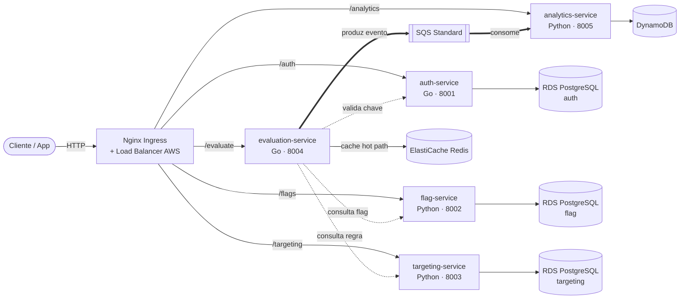

<div align="center">

# 🚀 ToggleMaster — DevOps & Cloud Architecture Journey

**Plataforma de Feature Flags · da arquitetura Monolítica aos Microsserviços Nativos em Nuvem**


</div>

---

## 📑 Índice

- [🛤 Sobre o Projeto (Visão Evolutiva)](#-sobre-o-projeto-visão-evolutiva)
- [🎯 O Desafio da Fase 2](#-o-desafio-da-fase-2)
- [🏗 Arquitetura da Solução](#-arquitetura-da-solução)
- [🧩 Os 5 Microsserviços](#-os-5-microsserviços)
- [🗄 Os 3 Data Stores + 1 Fila](#-os-3-data-stores--1-fila)
- [🐳 Conteinerização (Docker)](#-conteinerização-docker)
- [☸️ Orquestração (Kubernetes)](#️-orquestração-kubernetes)
- [☁️ Infraestrutura na Nuvem (AWS)](#️-infraestrutura-na-nuvem-aws)
- [📈 Escalabilidade](#-escalabilidade)
- [🔒 Segurança](#-segurança)
- [✅ Requisitos do Enunciado (Rastreabilidade)](#-requisitos-do-enunciado-rastreabilidade)
- [🚀 Como Executar](#-como-executar)
- [🚧 Desafios e Decisões Técnicas](#-desafios-e-decisões-técnicas)
- [📦 Entregáveis da Fase 2](#-entregáveis-da-fase-2)
- [🏷 Versionamento](#-versionamento)
- [👤 Autor](#-autor)

---

## 🛤 Sobre o Projeto (Visão Evolutiva)

Para espelhar cenários reais da indústria, o ToggleMaster evolui em fases, mantidas **no mesmo repositório** e marcadas com **Git Tags/Releases**:

- ✅ **`[CONCLUÍDA]` Fase 1:** MVP **monolítico** (Python/Flask) em EC2 + RDS privado na AWS.
- 🔵 **`[ATUAL]` Fase 2:** reescrita em **5 microsserviços** conteinerizados, orquestrados em **Kubernetes (AWS EKS)**, com escalabilidade automática.
- ⚪ **`[EM BREVE]` Fase 3 / Fase 4:** a definir.

> O histórico completo do monólito da Fase 1 segue preservado neste repositório (consulte a tag `v1.0.0-fase1`).

---

## 🎯 O Desafio da Fase 2

> *"O MVP monolítico do ToggleMaster foi um sucesso. A demanda explodiu, o monólito começou a apresentar gargalos, e a diretoria decidiu evoluir: o ToggleMaster será reescrito como um ecossistema de microsserviços distribuídos."*

A missão: pegar o código-fonte dos **5 microsserviços**, **conteinerizá-los**, **provisionar a infraestrutura de nuvem** e implantá-los em um ambiente de orquestração **robusto, escalável e resiliente**, que é o **Kubernetes na AWS (EKS)**.

Este projeto foi desenvolvido na **Opção B (conta pessoal AWS)**, que libera as ferramentas modernas de mercado: **`eksctl`**, **`helm`**, **IRSA** e **KEDA**.

---

## 🏗 Arquitetura da Solução


```mermaid
flowchart LR
    Client([Cliente / App]) -->|HTTP| ING[Nginx Ingress<br/>+ Load Balancer AWS]

    ING -->|/auth| AUTH[auth-service<br/>Go · 8001]
    ING -->|/flags| FLAG[flag-service<br/>Python · 8002]
    ING -->|/targeting| TGT[targeting-service<br/>Python · 8003]
    ING -->|/evaluate| EVAL[evaluation-service<br/>Go · 8004]
    ING -->|/analytics| ANL[analytics-service<br/>Python · 8005]

    AUTH --> RDSa[(RDS PostgreSQL<br/>auth)]
    FLAG --> RDSf[(RDS PostgreSQL<br/>flag)]
    TGT --> RDSt[(RDS PostgreSQL<br/>targeting)]

    EVAL -->|cache hot path| REDIS[(ElastiCache Redis)]
    EVAL -.valida chave.-> AUTH
    EVAL -.consulta flag.-> FLAG
    EVAL -.consulta regra.-> TGT
    EVAL ==>|produz evento| SQS[[SQS Standard]]
    SQS ==>|consome| ANL
    ANL --> DDB[(DynamoDB)]
```

**Fluxo de uma avaliação (`/evaluate`):** o cliente pergunta *"a flag X está ligada para o usuário Y?"* (com sua chave de API) → o **evaluation** consulta o **Redis** (resposta ultrarrápida); em *cache miss*, pergunta ao **flag** (a flag existe/está ativa?) e ao **targeting** (o usuário se encaixa nas regras?) → calcula o **`true/false`**, devolve a resposta e **publica um evento na fila SQS** → o **analytics** consome a fila e grava no **DynamoDB**, alimentando as estatísticas de produto.

---

## 🧩 Os 5 Microsserviços

| Serviço | Linguagem | Porta | Responsabilidade | Persistência |
|---|---|---|---|---|
| **auth-service** | Go | 8001 | Emite e valida chaves de API (a "portaria") | RDS PostgreSQL |
| **flag-service** | Python | 8002 | CRUD das definições de feature flags | RDS PostgreSQL |
| **targeting-service** | Python | 8003 | Regras de segmentação (para quem a flag vale) | RDS PostgreSQL |
| **evaluation-service** | Go | 8004 | *Hot path*: decisão final `true/false` + produz evento | ElastiCache Redis + SQS |
| **analytics-service** | Python | 8005 | Consome eventos da fila e grava estatísticas | DynamoDB (via SQS) |

---

## 🗄 Os 3 Data Stores + 1 Fila

Cada tipo de armazenamento foi escolhido pela natureza do dado que ele guarda. Usar a ferramenta certa para cada trabalho está no coração de uma arquitetura distribuída saudável.

| Recurso | Tipo | Por que esta escolha |
|---|---|---|
| **RDS PostgreSQL** | Relacional (SQL) | Dados **estruturados, duráveis e transacionais**: contas, flags e regras. Garante consistência **ACID** e relacionamentos, o que a torna ideal para o "registro da verdade". |
| **ElastiCache (Redis)** | Cache em memória | O *hot path* do **evaluation** precisa de leitura em **sub-milissegundo**. O Redis serve respostas pré-computadas a altíssima velocidade, aliviando os bancos relacionais. |
| **DynamoDB** | NoSQL (chave-valor) | O **analytics** tem **escrita massiva** de eventos com **esquema flexível**. O DynamoDB escala horizontalmente sem gerência de servidor e custa por requisição. Chave de partição: `event_id`. |
| **SQS (Standard)** | Fila de mensagens *(não é data store)* | **Desacopla** o produtor (evaluation) do consumidor (analytics). Se o analytics ficar lento ou cair, os eventos **aguardam na fila** sem travar o *hot path*, o que traz resiliência por design. |

> **A diferença essencial:** RDS responde *"qual é a verdade?"* (consistência), Redis responde *"rápido!"* (latência), DynamoDB responde *"muita escrita, esquema livre"* (escala), e o SQS é o **amortecedor** que conecta os dois mundos sem acoplá-los.

---

## 🐳 Conteinerização (Docker)

- **Dockerfiles multi-stage** para cada um dos 5 serviços:
  - **Go (auth, evaluation):** binário estático em imagem `scratch`/mínima → imagens de **~32 MB**.
  - **Python (flag, targeting, analytics):** base `slim`, dependências fixadas.
- **Boas práticas:** usuário **não-root**, `HEALTHCHECK`, `.dockerignore`, varredura de vulnerabilidades (`docker scout`).
- **`docker-compose.yml`** sobe o ecossistema completo: **9 contêineres** = 5 apps + **4 data stores locais** (2 PostgreSQL, 1 Redis, 1 DynamoDB Local), com `healthcheck` + `depends_on: service_healthy` garantindo a ordem de boot.

> Localmente, **um único PostgreSQL hospeda dois databases** (`flag_db` + `targeting_db`) via script de init, enquanto o `auth-db` fica isolado (fronteira de segurança). Na nuvem, isso se separa em **3 RDS independentes**, como pede o desafio.

---

## ☸️ Orquestração (Kubernetes)

Manifestos declarativos para os 5 serviços, seguindo as **boas práticas** exigidas:

- **Namespace** `togglemaster` (isolamento lógico).
- **Deployment** (Pods usando as imagens do **ECR**) + **Service** `ClusterIP` (descoberta interna por nome).
- **ConfigMap** (URLs de serviços internos, portas) + **Secret** em **base64** (senhas, endpoints e chaves).
- **Requests/Limits** em todos os Deployments (definindo a **QoS Class** e protegendo o Node).
- **Readiness / Liveness Probes** (`/health`): o readiness controla o tráfego, e o liveness reinicia os travados.
- **Ingress (Nginx)** com roteamento por path (`/auth`, `/flags`, `/targeting`, `/evaluate`, `/analytics`) e *rewrite-target*.

> O ambiente foi **validado integralmente no Kubernetes local** (Docker Desktop) **antes** de qualquer gasto na nuvem, por disciplina de custo e de-risking. Os manifestos de nuvem vivem em [`k8s/cloud/`](k8s/cloud).

---

## ☁️ Infraestrutura na Nuvem (AWS)

Provisionamento na **Opção B** (conta pessoal, IAM completo):

| Recurso | Implementação |
|---|---|
| **Cluster EKS** | `eksctl create cluster -f infra/cluster.yaml` (**Infra as Code**): K8s 1.32, 2× `t3.medium`, `withOIDC: true`, NAT desativado (nós públicos via Internet Gateway → economia). |
| **ECR** | 5 repositórios (um por serviço); imagens publicadas via `docker push`. |
| **RDS PostgreSQL × 3** | Instâncias independentes para auth, flag e targeting. |
| **ElastiCache (Redis)** | Cache do evaluation-service. |
| **DynamoDB** | Tabela `ToggleMasterAnalytics` (on-demand, PK `event_id`). |
| **SQS (Standard)** | Fila `togglemaster-analytics-events` (produtor: evaluation; consumidor: analytics). |
| **Metrics Server** | Necessário para o HPA medir CPU. |
| **Nginx Ingress Controller** | Provisiona o Load Balancer da AWS. |
| **IRSA** | `IAM Roles for Service Accounts` dão permissão **least-privilege** aos pods que falam com a AWS (evaluation → SQS; analytics → SQS + DynamoDB), **sem chaves estáticas**. |

### Por que 3 instâncias RDS separadas (Database per Service)

A melhor prática de mercado é manter uma instância de banco isolada por serviço, o padrão *Database per Service*, e foi ela que adotamos na nuvem, com três instâncias RDS independentes para auth, flag e targeting. A motivação é resiliência e escala. Compartilhar uma instância entre dois serviços criaria um ponto único de falha, já que um pico de carga no targeting poderia derrubar junto o flag, e ainda impediria dimensionar cada banco de forma independente.

No ambiente local, onde a especificação do Docker Compose pede exatamente duas instâncias de PostgreSQL, mantivemos o auth isolado por ser a fronteira de segurança que guarda os hashes das chaves de API, e reunimos flag e targeting em uma única instância com dois databases. Essa concessão vale apenas para o desenvolvimento local. Na nuvem, que representa o ambiente de produção, seguimos a separação completa.

---

## 📈 Escalabilidade

A escalabilidade foi desenhada **por perfil de serviço**: cada um escala pelo sinal que de fato reflete a sua carga.

### evaluation-service → HPA por CPU

O evaluation é o *hot path*, sensível a processamento. Ele escala por um **HorizontalPodAutoscaler** baseado na **utilização média de CPU** (alvo `70%`, `minReplicas: 1`, `maxReplicas: 5`).

- O **Metrics Server** é o "termômetro" que alimenta o HPA; sem ele, o HPA não consegue medir a CPU e fica cego.
- O HPA mede a CPU como **percentual do `request`** definido no Deployment, não em valor absoluto — por isso `requests` bem definidos são a régua da escala.
- `minReplicas: 1` mantém a demonstração legível (sai de 1 e cresce); `maxReplicas: 5` é a trava contra escalar sem limite e estourar a conta.

> Manifesto: [`k8s/cloud/evaluation/hpa.yaml`](k8s/cloud/evaluation/hpa.yaml).

### analytics-service → KEDA por profundidade da fila SQS

O analytics é **orientado a eventos**, então escalar por CPU seria reagir ao *efeito*, não à *causa*. Na nuvem (Opção B), ele escala com **KEDA**, que observa **diretamente a profundidade da fila SQS** e ajusta as réplicas de **0 a 5**.

- **Scale-to-zero:** com a fila vazia, o analytics fica em **zero pods** e não consome recurso; quando chegam eventos, o KEDA o **ativa a partir do zero** — algo que o HPA por CPU não faz.
- Gatilho `aws-sqs-queue` com `queueLength: "5"` (réplicas ≈ mensagens ÷ 5), `pollingInterval: 15s`, `cooldownPeriod: 60s`.
- O acesso do KEDA à fila é concedido via **IRSA** (`TriggerAuthentication` com `podIdentity: aws`, `identityOwner: keda`), mantendo o padrão de **não usar chaves estáticas**.

> Manifesto: [`k8s/cloud/analytics/scaledobject.yaml`](k8s/cloud/analytics/scaledobject.yaml).

### Por que dois mecanismos diferentes

O enunciado posiciona o **HPA por CPU** como requisito mínimo (o *workaround* da Opção A/Academy: a fila enche → a CPU sobe → escala) e o **KEDA** — escalar por `queueDepth` do SQS, de 0 a N — como o **"desafio real" recomendado para a Opção B**. Como este projeto roda em **conta pessoal**, o IRSA libera o KEDA sem workaround. A escolha foi **HPA-CPU no evaluation** e **KEDA-SQS no analytics**, cada serviço reagindo à sua própria causa. Como baseline compatível com a Opção A, o analytics também tem um HPA por CPU validado no ambiente local ([`k8s/analytics/hpa.yaml`](k8s/analytics/hpa.yaml)), substituído pelo KEDA na nuvem.

> **Demonstração combinada:** uma carga única no `/evaluate` faz **os dois** autoscalers reagirem ao mesmo tráfego — cada avaliação vira um evento na fila, então o evaluation escala por CPU e o analytics escala pela profundidade da SQS, ambos indo a 5 réplicas simultaneamente.

---

## 🔒 Segurança

- **Segredos fora do controle de versão:** `secret.yaml` é gitignored (`k8s/**/secret.yaml`); apenas templates `secret.yaml.example` são versionados.
- **Secrets em base64** nos manifestos (exigência do enunciado).
- **Resposta a vazamento aplicada na prática:** quando um secret foi commitado por engano, a resposta correta foi **rotacionar os valores primeiro** e depois limpar o histórico.
- **IRSA no lugar de chaves estáticas:** os pods recebem credenciais **temporárias** via OIDC; nenhuma *access key* fica armazenada em Secret.
- **Isolamento de rede e menor privilégio:** RDS/ElastiCache não expostos publicamente; cada IAM Role concede só o necessário.

---

## ✅ Requisitos do Enunciado (Rastreabilidade)

Mapa direto de cada requisito da Fase 2 para onde ele está implementado e documentado.

| # | Requisito (enunciado) | Onde está |
|---|---|---|
| 1 | Dockerfile otimizado (multi-stage) para os 5 microsserviços | [Conteinerização](#-conteinerização-docker) · `services/*/Dockerfile` |
| 2 | `docker-compose.yml` com 5 apps + 4 data stores (2 PostgreSQL, 1 Redis, 1 DynamoDB Local) | [Conteinerização](#-conteinerização-docker) · `docker-compose.yml` |
| 3 | Cluster EKS (Opção B, `eksctl`) | [Infra na Nuvem](#️-infraestrutura-na-nuvem-aws) · `infra/cluster.yaml` |
| 4 | 5 repositórios ECR + push das imagens | [Infra na Nuvem](#️-infraestrutura-na-nuvem-aws) |
| 5 | 3 instâncias RDS PostgreSQL independentes | [Database per Service](#por-que-3-instâncias-rds-separadas-database-per-service) |
| 6 | 1 cluster ElastiCache Redis | [Infra na Nuvem](#️-infraestrutura-na-nuvem-aws) |
| 7 | 1 tabela DynamoDB | [Data Stores](#-os-3-data-stores--1-fila) |
| 8 | 1 fila SQS Standard | [Data Stores](#-os-3-data-stores--1-fila) |
| 9 | Metrics Server instalado | [Infra na Nuvem](#️-infraestrutura-na-nuvem-aws) · [Como Executar](#3-provisionar-na-nuvem-aws-eks) |
| 10 | Nginx Ingress Controller (via IRSA na Opção B) | [Infra na Nuvem](#️-infraestrutura-na-nuvem-aws) |
| 11 | Manifestos: Namespace, Deployment, Service ClusterIP, Secret, ConfigMap | [Orquestração](#️-orquestração-kubernetes) · `k8s/cloud/` |
| 12 | Ingress com roteamento por path | [Orquestração](#️-orquestração-kubernetes) · `k8s/cloud/ingress.yaml` |
| 13 | Boas práticas: requests/limits, secrets em base64, readiness/liveness, namespaces | [Orquestração](#️-orquestração-kubernetes) · [Segurança](#-segurança) |
| 14 | HPA no evaluation-service por CPU (`70%`) | [Escalabilidade](#-escalabilidade) · `k8s/cloud/evaluation/hpa.yaml` |
| 15 | Escalabilidade do analytics: KEDA por `queueDepth` do SQS, de 0 a N (Opção B) | [Escalabilidade](#-escalabilidade) · `k8s/cloud/analytics/scaledobject.yaml` |
| 16 | Entregáveis: vídeo, relatório, links, badge Credly | [Entregáveis](#-entregáveis-da-fase-2) |

---

## 🚀 Como Executar

### 1. Rodar localmente (Docker Compose)

```bash
# Clonar
git clone https://github.com/artur-duart/togglemaster-devops-fiap.git
cd togglemaster-devops-fiap

# Configurar variáveis de ambiente locais
cp .env.example .env   # preencha os valores (senhas dos bancos e a AUTH_MASTER_KEY)

# Subir os 9 contêineres (5 apps + 4 data stores)
docker compose up -d --build

# Conferir a saúde
docker compose ps
```

### 2. Testar o fluxo end-to-end (na prática)

O jeito mais fácil é importar a coleção **[`togglemaster.postman_collection.json`](togglemaster.postman_collection.json)** no Postman: ela cobre o ciclo completo na ordem certa — *health checks → criar chave de API → criar flag → criar regra de targeting → avaliar*.

Preferindo a linha de comando, o mesmo fluxo sai com `curl` (a `MASTER_KEY` é o valor de `AUTH_MASTER_KEY` que você preencheu no `.env`):

```bash
# 1) Sanidade: os 5 serviços respondendo
for p in 8001 8002 8003 8004 8005; do curl -s localhost:$p/health; echo; done

# 2) Emitir uma chave de API (usa a MASTER_KEY) e guardar em KEY
KEY=$(curl -s -X POST localhost:8001/admin/keys \
  -H "Authorization: Bearer $AUTH_MASTER_KEY" -H "Content-Type: application/json" \
  -d '{"name":"demo"}' | grep -oE 'tm_key_[a-zA-Z0-9]+')

# 3) Criar uma feature flag
curl -s -X POST localhost:8002/flags \
  -H "Authorization: Bearer $KEY" -H "Content-Type: application/json" \
  -d '{"name":"feature-beta","description":"beta","is_enabled":true}'

# 4) Criar a regra de segmentação (100% → garante result:true)
curl -s -X POST localhost:8003/rules \
  -H "Authorization: Bearer $KEY" -H "Content-Type: application/json" \
  -d '{"flag_name":"feature-beta","is_enabled":true,"rules":{"type":"PERCENTAGE","value":100}}'

# 5) Avaliar: a flag está ligada para o usuário?
curl -s "localhost:8004/evaluate?user_id=user-1&flag_name=feature-beta"
# -> {...,"result":true}
```

O passo 5 fecha o ciclo: o evaluation consulta o cache no Redis, cai no flag e no targeting em caso de *miss*, calcula o `true/false` e publica o evento na fila para o analytics consumir.

### 3. Provisionar na nuvem (AWS EKS)

O caminho abaixo segue o método do enunciado (Opção B, conta pessoal): provisionar a infraestrutura, configurar o cluster e aplicar os manifestos.

```bash
# a) Cluster EKS como Infra as Code (cria VPC, nós e as roles de IAM)
eksctl create cluster -f infra/cluster.yaml
aws eks update-kubeconfig --region us-east-1 --name togglemaster

# b) Provisionar os recursos gerenciados (via Console ou AWS CLI):
#    5 repositórios ECR · 3 RDS PostgreSQL · 1 ElastiCache Redis
#    1 tabela DynamoDB · 1 fila SQS Standard
#    e publicar as 5 imagens nos repositórios ECR (docker build + push).

# c) Configurar o cluster
kubectl apply -f https://github.com/kubernetes-sigs/metrics-server/releases/latest/download/components.yaml   # HPA
helm install ingress-nginx ingress-nginx/ingress-nginx -n ingress-nginx --create-namespace                    # Ingress + Load Balancer
helm install keda kedacore/keda -n keda --create-namespace                                                    # autoscaling por fila

# d) Preencher os Secrets (endpoints e senhas dos recursos criados em "b") e aplicar os manifestos
kubectl apply -f k8s/cloud/ -R

# e) Validar
kubectl get pods -n togglemaster
kubectl get ingress -n togglemaster
kubectl get hpa -n togglemaster
kubectl get scaledobject -n togglemaster
```

> 💡 **Disciplina de custo:** a infra cobrada por hora (EKS, RDS, ElastiCache, Load Balancer) é provisionada apenas para a demonstração e **derrubada logo após** — apagando o Ingress/Load Balancer, rodando `eksctl delete cluster -f infra/cluster.yaml` e removendo os RDS e o ElastiCache.

---

## 🚧 Desafios e Decisões Técnicas

A jornada da Opção B (conta pessoal) trouxe desafios reais que moldaram as decisões do projeto:

### 1. A trava do Free Tier nos Node Groups
- **O Desafio:** o primeiro `eksctl create cluster` falhou, porque o *managed node group* estourou o timeout. O control plane subiu, mas os nós, não.
- **A Decisão:** o diagnóstico via `aws cloudformation describe-stack-events` revelou a causa exata: `InvalidParameterCombination - The specified instance type is not eligible for Free Tier`. A conta nova, em **"free plan"**, só permitia instâncias *free-tier-eligible*. A solução foi **migrar para o plano pago**, sem o qual EKS, RDS e ElastiCache nem chegam a rodar, aproveitando o crédito promocional e mantendo a disciplina de derrubar os recursos logo após cada sessão.

### 2. NAT Gateway desligado por design (FinOps)
- **O Desafio:** o `eksctl` cria um NAT Gateway por padrão (~US$0,045/h), mas ele só serve a sub-redes **privadas**.
- **A Decisão:** como os nós foram posicionados em **sub-rede pública** (saída via Internet Gateway, gratuita), o NAT é desnecessário. Defini `vpc.nat.gateway: Disable` no `cluster.yaml`, eliminando um custo silencioso clássico.

### 3. IRSA no lugar de credenciais estáticas
- **O Desafio:** os pods de evaluation e analytics precisam falar com SQS/DynamoDB. Localmente isso usava chaves *dummy* em Secret, o que é inseguro para produção.
- **A Decisão:** habilitei **OIDC** no cluster (`withOIDC: true`) e usei **IRSA**, de modo que cada serviço recebe uma ServiceAccount ligada a uma IAM Role *least-privilege*, com credenciais temporárias. As chaves estáticas **deixaram de existir** na nuvem.

### 4. Um Postgres, dois bancos (local) → três RDS (nuvem)
- **O Desafio:** localmente, flag e targeting compartilhavam uma instância PostgreSQL com dois databases (economia de recursos no laptop).
- **A Decisão:** na nuvem, o enunciado pede **isolamento real**, com três instâncias RDS independentes. Os manifestos de nuvem refletem essa separação, com cada serviço apontando para seu próprio endpoint.

### 5. Um Secret vazado e a ordem certa de reagir
- **O Desafio:** em algum momento commitei um Secret do Kubernetes com os valores em base64 para o GitHub. Como base64 é apenas codificação reversível, e não criptografia, na prática aquilo vazou.
- **A Decisão:** a resposta seguiu a ordem que vale na vida real. Primeiro rotacionei os segredos, partindo do princípio de que tudo que toca um repositório remoto deve ser tratado como comprometido para sempre. Só depois limpei o histórico. Como o conteúdo estava em um único commit, um `git commit --amend` com `--force-with-lease` resolveu, sem precisar de ferramenta pesada como o BFG. Para não repetir o erro, passei a versionar apenas um `secret.yaml.example` com placeholders, deixando o arquivo real no `.gitignore`.

### 6. Código que não compilava e a lição da reprodutibilidade
- **O Desafio:** o código-fonte recebido não buildava de primeira. O auth-service tinha um `go.mod` malformado e estava sem o `go.sum`, e os serviços em Python quebravam no boot por causa de um erro no Werkzeug.
- **A Decisão:** no lado Go, um `go mod tidy` reconstruiu as dependências. No lado Python, o problema era mais sutil. O Werkzeug é uma dependência transitiva do Flask, não estava com a versão travada, e uma versão mais nova havia removido uma função que a aplicação usava. Bastou fixar o Werkzeug na versão correta. O episódio reforçou, na prática, por que reprodutibilidade de verdade exige travar até as dependências indiretas.

### 7. KEDA sem permissão para ler a fila (403 AssumeRole)
- **O Desafio:** com o `identityOwner` errado, o operador do KEDA tentava assumir a Role do próprio serviço e batia em **`403 AssumeRole`** (`KEDAScalerFailed`), sem conseguir ler a profundidade da fila. O analytics ficava travado em zero.
- **A Decisão:** dei ao **keda-operator** a sua própria ServiceAccount via IRSA, com uma policy *least-privilege* de leitura da fila (`sqs:GetQueueAttributes`), e ajustei o `TriggerAuthentication` para `identityOwner: keda`. O scale-from-zero passou a funcionar de imediato.

### 8. Metrics Server e a carga que precisa vir de dentro
- **O Desafio:** logo após subir, o HPA aparecia com CPU `<unknown>`; e a primeira tentativa de gerar carga a partir da minha máquina saturava o meu PC antes do pod, e a CPU do serviço mal chegava a 60%.
- **A Decisão:** o `<unknown>` some sozinho depois que o Metrics Server coleta a primeira janela (~1 min). E a carga passou a ser gerada **de dentro do cluster**, com um Pod efêmero de load (`hey`), colocando a pressão no serviço e não na minha rede. Com isso, os dois autoscalers subiram juntos até 5 réplicas sob o mesmo tráfego.

---

## 📦 Entregáveis da Fase 2

- 🎥 **Vídeo de Demonstração** (até 20 min): [youtu.be/zUtUB7HrsFI](https://youtu.be/zUtUB7HrsFI)
- 💻 **Repositório:** [github.com/artur-duart/togglemaster-devops-fiap](https://github.com/artur-duart/togglemaster-devops-fiap) (tag da entrega: `v2.0.0-fase2`)
- 📄 **Relatório de Entrega:** documento em PDF enviado junto à submissão da fase (nome, RM, usuário do Discord e os links de entrega).
- 🏅 **Trilha Google Cloud Skills Boost** (pontuação extra, +10): [badge público no Credly](https://www.credly.com/badges/99eb0dd5-f203-40c2-9c6c-6f72e72ec9f2/public_url) ✅ concluída

---

## 🏷 Versionamento

Usamos **Git Tags** para marcar a entrega de cada fase da pós-graduação:

- `v1.0.0-fase1`: MVP Monolítico (EC2 + RDS).
- `v2.0.0-fase2`: Ecossistema de Microsserviços em Kubernetes/EKS.

---

## 👤 Autor

**Artur Duarte de Moraes** — RM 370569
IT Operation Engineer no Banco Bradesco · Pós-graduando em DevOps & Cloud Architecture (FIAP)

[](https://www.linkedin.com/in/artur-duarte-5141aa212)
[](https://github.com/artur-duart)
